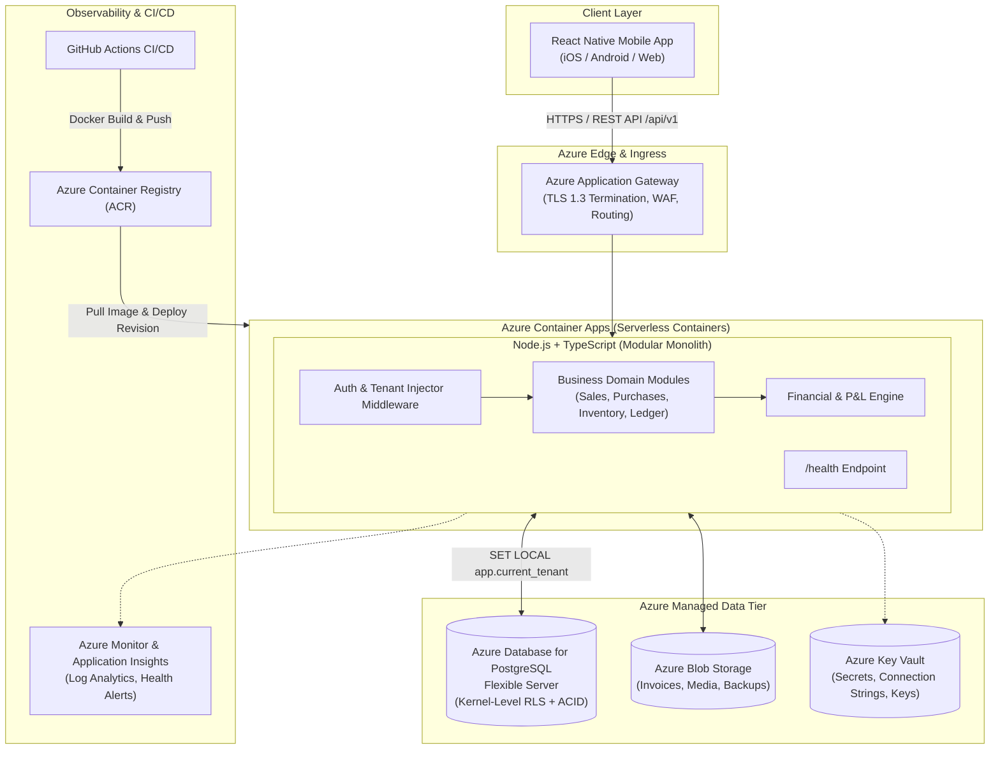
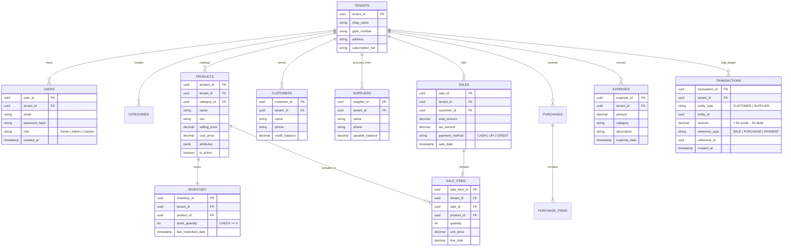

# Cloud-Native Multi-Tenant FinTech Platform for MSME Retailers

> **Authoritative Project Blueprint & Master Documentation**  
> *A production-grade, multi-tenant B2B FinTech mobile SaaS platform engineered for micro, small, and medium retail enterprises (kirana stores) in India.*

---

## 📌 Executive Summary

The informal retail sector in India comprises millions of neighborhood *kirana* stores and micro-enterprises operating at high transaction frequency but low technological penetration. Most still rely on paper ledgers (*bahi khata*) or fragmented spreadsheets, resulting in calculation errors, cash drawer mismatches, untracked customer credit (*udhaar*), inventory stockouts, and catastrophic data loss risks.

This project delivers a **cloud-native, multi-tenant Software-as-a-Service (SaaS) platform** that unifies billing (POS), inventory control, customer credit, supplier payables, expense tracking, and real-time financial reporting into a seamless, mobile-first experience.

```
+-----------------------------------------------------------------------------------+
|                                 CORE HIGHLIGHTS                                   |
+-----------------------------------------------------------------------------------+
|  • Frontend:       React Native (TypeScript) - Cross-Platform Mobile POS          |
|  • Backend:        Node.js + TypeScript (Express/Fastify) Modular Monolith        |
|  • Database:       Azure Database for PostgreSQL Flexible Server                  |
|  • Multi-Tenancy:  Pool Model (Shared DB + Shared Schema) via Kernel-Level RLS    |
|  • Cloud:          Microsoft Azure (Container Apps, ACR, App Gateway, Key Vault)  |
|  • Data Integrity: Strict ACID Transactions, Double-Entry Simulation, FIFO COGS   |
|  • DevOps:         Dockerized containers automated with GitHub Actions CI/CD      |
+-----------------------------------------------------------------------------------+
```

---

## 🎯 The Real-World Problem & Opportunity

### The Informal Retail Dilemma
A typical neighborhood kirana store (e.g., *"Shree Ganesh General Store"*) handles hundreds of fast-moving items, daily cash/digital sales, and intricate informal credit lines. Analog management introduces compounding operational vulnerabilities:
1. **Manual Bookkeeping Errors**: Transcribing sales and credits by hand produces calculation discrepancies and uncollected dues.
2. **Inventory Blindspots**: Inability to reconcile physical stock with sales leads to stockouts of top-selling items and capital tied up in dead stock.
3. **Credit (Udhaar) Leakage**: Customer credit tracked on loose pages frequently leads to dispute, missed repayments, and cash flow asphyxiation.
4. **Disaster Recovery Void**: Physical notebooks offer zero disaster recovery; theft, fire, or water damage permanently wipes out accounts receivable.
5. **Lack of Financial Intelligence**: Owners cannot accurately determine daily gross margin, net profit, or cost of goods sold (COGS).

### The Solution
A unified, intuitive mobile platform designed for varying digital literacy levels that digitizes operations on the shop floor while synchronizing transaction streams to an enterprise-grade cloud backend.

---

## 🥊 Competitive Positioning & Market Differentiation

| Competitor | Primary Focus | Pricing Model | Strengths | Strategic Gap / Why We Win |
| :--- | :--- | :--- | :--- | :--- |
| **Khatabook** | Customer credit (*udhaar*) | Free core; paid add-ons | Simple UX; WhatsApp reminders | Primarily a ledger; lacks multi-counter POS, catalog depth, and robust inventory. |
| **Vyapar** | Offline billing & inventory | ₹3,000–₹6,000/yr | Strong offline billing & barcode support | Multi-device cloud sync is inconsistent; desktop-mobile parity issues. |
| **myBillBook** | Mobile billing & distribution | ₹2,500–₹4,000/yr | Fast mobile POS billing | Struggles with multi-store chains; desktop features rely on beta tools. |
| **Zoho Books** | Comprehensive ERP/Accounting | Tiered up to ₹3,600+/mo | Enterprise suite; banking integrations | Steep learning curve; far too complex for rapid, single-counter kirana checkout. |
| **TallyPrime** | Traditional accounting ERP | ₹18,000/yr (Legacy) | Indian accounting gold standard; GST | High upfront cost; desktop-bound; requires formal accounting qualification. |

**Our Sweet Spot**: Combining the **UX simplicity of Khatabook** with the **inventory robustness of Vyapar**, built on an **API-first, cloud-native Azure architecture** with rigorous **PostgreSQL Row-Level Security**.

---

## 🏛️ System Architecture

The system is structured as a **Modular Monolith** running inside Docker containers on **Azure Container Apps**. This pattern prevents the premature network latency and service mesh complexity of microservices, while eliminating serverless "cold starts" during rapid customer checkout.

### Cloud Architecture Flow



---

## 🔐 Multi-Tenancy & Data Isolation Model

Selecting the correct multi-tenancy model dictates cost, security, and scalability:

* **Silo Model (Separate DB per shop)**: Too expensive for thousands of micro-merchants.
* **Bridge Model (Separate Schema per shop)**: Migration nightmare across thousands of schemas.
* **Pool Model (Shared DB + Shared Schema with `tenant_id`)**: **Chosen Approach**. Maximizes resource density, minimal cloud operational overhead.

### Preventing "Leaky Tenants" via PostgreSQL Row-Level Security (RLS)

Application-level filtering (e.g., adding `WHERE tenant_id = x` in ORM queries) is prone to developer oversight. We enforce data isolation directly at the database kernel level:

1. **Zero Client Trust**: The mobile app **never** sends `tenant_id` in request payloads.
2. **Cryptographic Extraction**: Backend middleware verifies the stateless JWT and securely extracts `tenant_id`.
3. **Session Context Injection**:
   ```sql
   SET LOCAL app.current_tenant = 'd3b07384-d113-49cd-a5be-912a20b2f901';
   ```
4. **Kernel Enforcement**:
   ```sql
   ALTER TABLE sales ENABLE ROW LEVEL SECURITY;
   
   CREATE POLICY tenant_isolation ON sales
     FOR ALL
     USING (tenant_id = current_setting('app.current_tenant')::uuid);
   ```
5. **Connection Pool Hygiene**: Tenant context is explicitly cleared before connections return to the pool, preventing identity inheritance between HTTP requests.

---

## 🗄️ Database Design & Entity Model

The relational schema strictly enforces foreign key constraints and ACID properties. All operational tables are tenant-scoped:



---

## 💼 Core Business Logic & Financial Integrity

### 1. Atomic POS Sale Execution
A sale must never partially execute. The following operations are wrapped inside a single atomic database transaction (`BEGIN ... COMMIT / ROLLBACK`):
1. Verify user identity and inject tenant context.
2. Verify available inventory (`stock_quantity >= requested_quantity`).
3. Insert master record into `sales`.
4. Insert line items into `sale_items`.
5. Decrement inventory atomically.
6. If payment is `CREDIT`, increase `customers.credit_balance`.
7. Insert double-entry journal record into `transactions`.
8. Commit transaction.

> **Zero Negative Stock Rule**: Database enforces `CHECK (stock_quantity >= 0)`. If available stock is 5 and a cashier attempts to bill 10, the entire transaction aborts immediately with no partial state updates.

### 2. Double-Entry Ledger & Credit Tracking
* **Credit Sale**: Debits Customer Accounts Receivable (`credit_balance` increases) and credits Sales Revenue.
* **Customer Debt Payment**: Customer pays cash -> decreases `credit_balance` and records incoming cash transaction.
* **Supplier Purchase**: Increases `inventory` and increases Supplier `payable_balance`.
* **Supplier Payment**: Decreases `payable_balance` and records outgoing cash.

### 3. Financial Metrics Formulas
* **Revenue**: $\sum (\text{SaleItems.line\_total})$
* **Cost of Goods Sold (COGS)**: Calculated dynamically using **FIFO (First-In, First-Out)** or Moving Average Cost to ensure historical margin accuracy.
* **Gross Profit**: $\text{Revenue} - \text{COGS}$
* **Net Profit**: $\text{Gross Profit} - \text{Operating Expenses (Rent, Salaries, Utilities)}$

---

## 🌐 RESTful API Inventory (`/api/v1`)

All endpoints are strictly authenticated via Bearer JWT (except registration & login).

### Authentication & Tenant Onboarding
* `POST /api/v1/auth/register` — Provisions shop tenant, creates owner user, generates JWT.
* `POST /api/v1/auth/login` — Verifies credentials, returns signed JWT.
* `GET  /api/v1/me` — Retrieves authenticated user profile & tenant info.

### Categories & Catalog
* `GET    /api/v1/categories` — Lists product categories.
* `POST   /api/v1/categories` — Creates category.
* `PUT    /api/v1/categories/:id` — Updates category.
* `DELETE /api/v1/categories/:id` — Deletes category.
* `GET    /api/v1/products` — Retrieves paginated product catalog.
* `POST   /api/v1/products` — Adds new product with pricing & JSONB attributes.
* `PUT    /api/v1/products/:id` — Updates product details or price.
* `DELETE /api/v1/products/:id` — Soft-deactivates product (preserves historical invoices).

### Inventory
* `GET  /api/v1/inventory` — Retrieves current stock levels & low stock alerts.
* `POST /api/v1/inventory/restock` — Manual stock correction or incoming restock.

### POS Sales & Invoicing
* `POST /api/v1/sales` — Processes atomic sale, decrements stock, updates ledger.
* `GET  /api/v1/sales` — Paginated sales history.
* `GET  /api/v1/sales/:id` — Detailed bill with line items.

### Procurement & Purchases
* `POST /api/v1/purchases` — Records distributor purchase, increments inventory.
* `GET  /api/v1/purchases` — Purchase order history.

### Customers & Udhaar Credit
* `GET  /api/v1/customers` — Lists customers & outstanding credit.
* `POST /api/v1/customers` — Creates customer record.
* `GET  /api/v1/customers/:id` — Customer credit history & dues.
* `PUT  /api/v1/customers/:id` — Updates customer details.
* `POST /api/v1/customers/:id/payments` — Records credit repayment, updates balance.

### Suppliers & Payables
* `GET  /api/v1/suppliers` — Lists distributors & payable dues.
* `POST /api/v1/suppliers` — Creates supplier.
* `GET  /api/v1/suppliers/:id` — Supplier invoice history.
* `PUT  /api/v1/suppliers/:id` — Updates supplier details.
* `POST /api/v1/suppliers/:id/payments` — Records payment to distributor.

### Expenses & Financial Reporting
* `POST /api/v1/expenses` — Logs shop operating expense (rent, electricity, etc.).
* `GET  /api/v1/expenses` — Lists expenses by date range.
* `GET  /api/v1/ledger` — Unified audit ledger entries.
* `GET  /api/v1/reports/sales` — Aggregated sales summary.
* `GET  /api/v1/reports/profit-loss` — Revenue, COGS, Gross Profit, Expenses, Net Profit.
* `GET  /api/v1/dashboard/summary` — Home dashboard at-a-glance metrics.
* `GET  /health` — Container liveness & readiness probe.

---

## 👥 Team Ownership & Responsibility Matrix

| Team Member | Core Focus | Direct Ownership Deliverables | What They Hand Off |
| :--- | :--- | :--- | :--- |
| **Member 1** | **React Native Mobile App** | Mobile UI/UX, Navigation, Auth screens, POS billing, Inventory, Customers/Credit, Expenses, Dashboard, API integration (Axios/fetch), Secure client token storage. | Consumes REST APIs built by Member 3. |
| **Member 2** | **Database, Auth & Multi-Tenancy** | PostgreSQL schema, Prisma/Drizzle ORM setup, Migrations, Seed data, JWT auth, Password hashing, RBAC middleware, RLS policies, connection pool safety, Azure PostgreSQL configuration. | Delivers DB/Auth contract to Member 3; Azure DB connection to Member 4. |
| **Member 3** | **Business Backend, Logic & Docker** | Express/Fastify REST APIs, Atomic sales processing, Stock deduction/addition, Ledger, FIFO P&L calculations, Azure Blob integration, Dockerfile, `/health` endpoint. | Delivers stable API contract to Member 1; Tested Docker container to Member 4. |
| **Member 4** | **Azure Cloud & DevOps** | Azure Resource Groups, Container Registry (ACR), Container Apps, Application Gateway (TLS/HTTPS), Azure Monitor & Key Vault, VNet/NSGs, GitHub Actions CI/CD pipelines. | Provides deployed cloud environments, URLs, and deployment pipelines to the team. |

---

## ⚖️ Authoritative Project Scope Decisions

> ⚠️ **CRITICAL ALIGNMENT (Supersedes older drafts)**:
> 1. **Cloud Platform**: **Microsoft Azure is the chosen cloud provider** (replaces AWS).
> 2. **Client**: **React Native Mobile App ONLY**. No separate Next.js web portal in the MVP.
> 3. **AI/ML**: **Explicitly excluded from initial MVP** (No ARIMA forecasting, no RAG LLM query assistant). Focus is 100% on the core operational SaaS platform.
> 4. **No Kubernetes / AKS**: Azure Container Apps is chosen for serverless container orchestration to eliminate Kubernetes baseline cost and overhead.

---

## 🧪 Critical Test Cases & Validation Strategy

1. **Tenant Isolation Test (RLS Verification)**:
   * Shop A registers and creates product *"Basmati Rice 5kg"*.
   * Shop B registers, logs in, and requests `GET /api/v1/products`.
   * **Verification**: Shop B must receive an empty list and cannot view or modify Shop A's catalog or ledger under any circumstances.
2. **Sale Atomicity & Rollback Test**:
   * Stock of *Milk* is currently 5 units.
   * A cashier attempts to bill 10 units.
   * **Verification**: Request must fail with an inventory error. Stock remains 5; no sales record is created; no customer credit is added; no partial ledger entry exists.
3. **Concurrency Test**:
   * Two mobile cashiers bill the final 1 unit of *Cooking Oil* simultaneously.
   * **Verification**: Row-level locking (`SELECT ... FOR UPDATE`) guarantees only one transaction succeeds, and the other is safely rejected without negative inventory.
4. **End-to-End Cloud Deployment**:
   * Code pushed to `main` -> GitHub Actions triggers test suite -> builds Docker container -> pushes to Azure Container Registry -> updates Azure Container Apps -> mobile app transacts over HTTPS.

---

## 📁 Repository Structure

```
CloudComputingCP/
├── mobile/                   # [Member 1] React Native + TypeScript
│   ├── src/
│   │   ├── components/       # Reusable UI widgets
│   │   ├── navigation/       # React Navigation stacks
│   │   ├── screens/          # Login, Register, Home, POS, Inventory, etc.
│   │   ├── services/         # Axios API clients & secure token storage
│   │   └── types/            # TypeScript models
│   ├── package.json
│   └── app.json
│
├── backend/                  # [Member 2 & Member 3] Node.js + TypeScript
│   ├── src/
│   │   ├── config/           # Environment and DB pool settings
│   │   ├── middleware/       # Auth, JWT, Tenant Context, RLS injector
│   │   ├── modules/
│   │   │   ├── auth/         # Register, Login, /me
│   │   │   ├── catalog/      # Products, Categories
│   │   │   ├── inventory/    # Stock levels, adjustments
│   │   │   ├── sales/        # Atomic POS billing
│   │   │   ├── purchases/    # Supplier procurement
│   │   │   ├── credit/       # Customer udhaar & supplier debt
│   │   │   ├── expenses/     # Shop expenses
│   │   │   └── reports/      # P&L, Daily Dashboard metrics
│   │   ├── index.ts          # Server entrypoint
│   │   └── health.ts         # GET /health probe
│   ├── prisma/               # Prisma schema & migrations [Member 2]
│   │   ├── schema.prisma
│   │   └── migrations/
│   ├── Dockerfile            # Production Docker image [Member 3]
│   └── package.json
│
├── infrastructure/           # [Member 4] Azure Cloud Configuration
│   ├── terraform/            # (or Bicep/ARM/Azure CLI scripts)
│   └── azure/
│
├── .github/
│   └── workflows/
│       └── deploy.yml        # CI/CD GitHub Actions pipeline [Member 4]
│
├── docs/                     # Documentation, ERD, API specs
└── README.md                 # Master Project Blueprint
```

---

## 🎓 Cloud Computing Evaluation & Viva Reference

* **Cloud-Native**: Designed natively for managed cloud infrastructure (Container Apps, Flexible Server, Blob, Key Vault).
* **Multi-Tenancy (Pool Model)**: Multiple independent businesses share compute and database infrastructure while maintaining logical isolation.
* **Row-Level Security (RLS)**: Enforces access control at the database kernel level rather than relying on application code.
* **Azure Container Apps**: Serverless container execution with automatic scaling, self-healing, and zero baseline orchestrator fee.
* **Application Gateway**: Reverse proxy handling SSL/TLS termination, URL routing, and security policies.
* **Atomic Transactions**: Guarantees ACID properties for financial data; prevents desynchronization between inventory and billing.